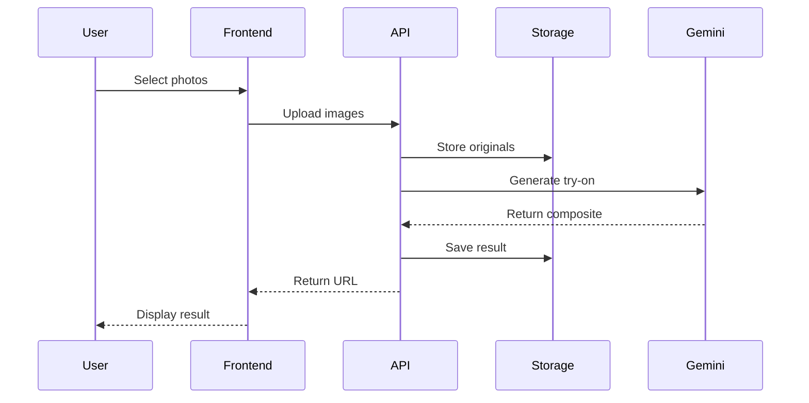
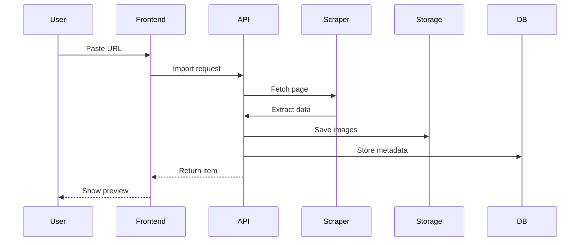

# FitCheck - Implementation Plan & Technical Architecture

## Executive Summary

FitCheck is an AI-powered virtual try-on application that allows users to visualize how clothing items would look on them using Google's Gemini 2.5 Flash Image model. The application combines advanced AI image generation with practical features like size recommendations, outfit management, and a personal digital closet.

## Project Goals

1. **Virtual Try-On**: Realistic clothing visualization on user photos using AI
2. **Size Intelligence**: Automated fit recommendations based on measurements
3. **Digital Closet**: Personal wardrobe management and outfit saving
4. **Product Import**: URL-based clothing import with automatic data extraction
5. **User Experience**: Intuitive interface for fashion experimentation

## Technical Architecture

### System Overview

```
┌─────────────┐     ┌──────────────┐     ┌─────────────────┐
│   Next.js   │────▶│  API Routes  │────▶│  Google Gemini  │
│   Frontend  │     │  (Serverless)│     │   2.5 Flash     │
└─────────────┘     └──────────────┘     └─────────────────┘
       │                    │                      
       ▼                    ▼                      
┌─────────────┐     ┌──────────────┐     ┌─────────────────┐
│   NextAuth  │     │   Supabase   │     │  Strands Agent  │
│    (Auth)   │     │  (Database)  │     │   (Scraping)    │
└─────────────┘     └──────────────┘     └─────────────────┘
```

### Technology Stack

#### Frontend
- **Framework**: Next.js 14 with App Router
- **UI Library**: React 18 with TypeScript
- **Styling**: Tailwind CSS + Shadcn/ui components
- **State Management**: Zustand for global state, React Query for server state
- **Image Handling**: react-image-crop, react-dropzone
- **Forms**: React Hook Form + Zod validation

#### Backend
- **Runtime**: Node.js serverless functions (Netlify Functions)
- **Authentication**: NextAuth.js with multiple providers
- **Database**: Supabase (PostgreSQL) with Prisma ORM
- **Storage**: Supabase Storage for images
- **AI Integration**: Google Generative AI SDK (@google/generative-ai)

#### Infrastructure
- **Hosting**: Netlify (static + serverless)
- **CDN**: Netlify Edge Network
- **Environment**: Serverless functions with 10MB limit

## Core Features Implementation

### 1. Virtual Try-On System

#### Image Processing Pipeline
```typescript
1. User uploads baseline photo (full body/portrait)
2. User selects/uploads clothing item
3. System prepares images:
   - Resize to optimal resolution (1024px max)
   - Convert to base64 format
   - Apply background removal if needed
4. Call Gemini API with multi-image fusion
5. Process and display result
6. Optional: Apply filters or edits
```

#### Gemini Integration Architecture
```typescript
// Core service structure
class GeminiService {
  - initializeModel(apiKey: string)
  - generateTryOn(userImage: Buffer, clothingImage: Buffer, prompt: string)
  - applyFilter(image: Buffer, filterType: string)
  - editImage(image: Buffer, instruction: string, coordinates?: Point)
}
```

### 2. User Account System

#### Authentication Flow
1. **Registration**: Email/password or OAuth (Google)
2. **Profile Setup**: Measurements, preferences, baseline photos
3. **Session Management**: JWT tokens with secure cookies
4. **Authorization**: API route protection via middleware

#### User Data Structure
```typescript
interface User {
  id: string
  email: string
  profile: {
    measurements: {
      height: number
      chest: number
      waist: number
      inseam: number
      wingspan: number
    }
    preferences: {
      style: string[]
      brands: string[]
      sizes: Record<string, string>
    }
  }
  subscription: 'free' | 'premium'
  baselineImages: BaselineImage[]
}
```

### 3. Digital Closet Management

#### Data Models
```prisma
// Simplified schema
model ClothingItem {
  id          String   @id
  userId      String
  name        String
  category    String   // shirt, pants, shoes, etc.
  brand       String?
  sourceUrl   String?
  imageUrl    String
  sizingData  Json?    // Extracted measurements
  metadata    Json?
  
  user        User     @relation(...)
  outfits     OutfitItem[]
}

model Outfit {
  id          String   @id
  userId      String
  name        String
  imageUrl    String   // Generated composite
  items       OutfitItem[]
  createdAt   DateTime
}
```

### 4. Intelligent Sizing System

#### Size Extraction Pipeline
```typescript
1. URL Input → Fetch HTML
2. Parse for:
   - Product images (og:image, main images)
   - Size chart links
   - Measurement tables
3. Extract data via:
   - DOM parsing (Cheerio)
   - Pattern matching
   - Optional: AI agent for complex extraction
4. Store structured data:
   {
     sizes: { S: {...}, M: {...}, L: {...} },
     measurements: { chest: [], waist: [] },
     modelInfo: { height: "6'2", wearing: "M" }
   }
```

#### Fit Recommendation Algorithm
```typescript
function checkFit(userMeasurements, itemSizing) {
  // Calculate differences
  const chestDiff = (userMeasurements.chest - itemSizing.chest) / itemSizing.chest
  const waistDiff = (userMeasurements.waist - itemSizing.waist) / itemSizing.waist
  
  // Generate recommendations
  if (chestDiff > 0.05) return "May be tight in chest"
  if (waistDiff < -0.05) return "May be loose in waist"
  return "Good fit expected"
}
```

## API Routes Architecture

### Core Endpoints

#### Authentication (`/api/auth/*`)
- `[...nextauth]` - NextAuth handler
- Providers: Email, Google OAuth
- Database sessions with Prisma adapter

#### User Management (`/api/user/*`)
- `GET /profile` - Fetch user profile
- `PUT /measurements` - Update measurements
- `POST /baseline-images` - Upload baseline photos
- `DELETE /baseline-images/:id` - Remove photos

#### Clothing Operations (`/api/clothing/*`)
- `POST /import-url` - Import from product URL
- `POST /upload` - Direct image upload
- `GET /items` - List user's items
- `DELETE /items/:id` - Remove item
- `GET /items/:id/sizing` - Get size info

#### AI Operations (`/api/ai/*`)
- `POST /try-on` - Generate virtual try-on
- `POST /edit` - Apply edits to image
- `POST /filter` - Apply style filters
- `POST /extract-measurements` - Extract from image
- `POST /remove-background` - Clean clothing images

#### Outfit Management (`/api/outfits/*`)
- `POST /create` - Save outfit
- `GET /list` - User's outfits
- `PUT /:id` - Update outfit
- `DELETE /:id` - Remove outfit
- `POST /:id/share` - Generate share link

## Google Gemini Integration

### Model Configuration
```typescript
const model = genAI.getGenerativeModel({
  model: "gemini-2.5-flash-image-preview",
  generationConfig: {
    temperature: 0.4,      // Lower for consistency
    topP: 1,
    topK: 32,
    maxOutputTokens: 4096,
  },
  safetySettings: [
    {
      category: HarmCategory.HARM_CATEGORY_HARASSMENT,
      threshold: HarmBlockThreshold.BLOCK_MEDIUM_AND_ABOVE,
    }
  ]
})
```

### Prompt Engineering
```typescript
const tryOnPrompt = `
You are an expert fashion AI specializing in virtual try-ons.

Given:
- Image A: Photo of a person
- Image B: Clothing item

Task: Generate a photorealistic image of the person wearing the clothing item.

Requirements:
1. Maintain the person's pose, face, and body proportions
2. Apply realistic fabric draping and shadows
3. Match lighting conditions between images
4. Ensure proper sizing and fit
5. Preserve clothing details (patterns, textures, logos)

Output: Single composite image only.
`
```

### Error Handling
```typescript
try {
  const result = await model.generateContent({
    contents: [{
      role: 'user',
      parts: [
        { text: prompt },
        { inlineData: { mimeType: 'image/jpeg', data: userImageBase64 }},
        { inlineData: { mimeType: 'image/jpeg', data: clothingImageBase64 }}
      ]
    }]
  })
  
  // Check for safety blocks
  if (result.response.promptFeedback?.blockReason) {
    throw new Error(`Content blocked: ${blockReason}`)
  }
  
  // Extract image
  const image = result.response.candidates[0].content.parts.find(
    part => part.inlineData?.mimeType?.startsWith('image/')
  )
  
} catch (error) {
  // Handle rate limits, safety blocks, API errors
}
```

## Data Flow Architecture

### Virtual Try-On Flow


### Product Import Flow


## Security Architecture

### Authentication & Authorization
- JWT tokens with HttpOnly cookies
- Session validation on every API call
- User-scoped data access only
- Rate limiting per user

### Data Protection
- Image encryption at rest (Supabase)
- Private storage buckets per user
- GDPR-compliant data handling
- Secure API key management

### Input Validation
- URL sanitization for scraping
- Image format validation
- Size limits (10MB per image)
- Content moderation via Gemini safety

## Performance Optimization

### Image Processing
- Client-side resize before upload
- Progressive image loading
- CDN caching for static assets
- Lazy loading for gallery views

### API Optimization
- Parallel processing where possible
- Response caching with React Query
- Database query optimization
- Connection pooling

### Serverless Considerations
- Cold start mitigation
- Bundle size optimization
- Function timeout handling (10s limit)
- Graceful degradation

## Deployment Strategy

### Netlify Configuration
```toml
# netlify.toml
[build]
  command = "npm run build"
  publish = ".next"

[functions]
  directory = "netlify/functions"
  node_bundler = "esbuild"

[[headers]]
  for = "/*"
  [headers.values]
    X-Frame-Options = "DENY"
    X-Content-Type-Options = "nosniff"

[build.environment]
  NEXT_USE_NETLIFY_EDGE = "true"
```

### Environment Variables
```env
# Required for deployment
NEXTAUTH_URL=https://fitcheck.app
NEXTAUTH_SECRET=[generated]
DATABASE_URL=postgresql://...
GOOGLE_AI_API_KEY=[from Google AI Studio]
SUPABASE_URL=https://[project].supabase.co
SUPABASE_ANON_KEY=[public key]
SUPABASE_SERVICE_KEY=[secret key]
```

## Development Phases

### Phase 1: Foundation (Week 1)
- [ ] Project setup and configuration
- [ ] Authentication system
- [ ] Database schema and migrations
- [ ] Basic UI components

### Phase 2: Core Features (Week 2-3)
- [ ] User profile management
- [ ] Image upload and storage
- [ ] Gemini API integration
- [ ] Basic virtual try-on

### Phase 3: Intelligence (Week 4)
- [ ] URL import functionality
- [ ] Size extraction system
- [ ] Fit recommendations
- [ ] Outfit management

### Phase 4: Enhancement (Week 5)
- [ ] Image editing features
- [ ] Filter system
- [ ] Sharing functionality
- [ ] Performance optimization

### Phase 5: Polish (Week 6)
- [ ] UI/UX refinement
- [ ] Error handling
- [ ] Testing
- [ ] Documentation

## Cost Analysis

### API Costs
- Gemini 2.5 Flash: ~$0.04 per image generation
- Average user: 10-20 generations per session
- Monthly estimate: $2-4 per active user

### Infrastructure Costs
- Netlify: Free tier covers most needs
- Supabase: Free tier (500MB storage, 2GB bandwidth)
- Domain: ~$15/year

### Monetization Strategy
- Free tier: 10 try-ons per month
- Premium ($2/month): Unlimited try-ons
- Future: Affiliate partnerships

## Risk Mitigation

### Technical Risks
- **API Limits**: Implement queuing and rate limiting
- **Image Quality**: Validate inputs, provide guidelines
- **Model Failures**: Graceful error handling, retry logic
- **Storage Limits**: Image compression, cleanup policies

### Business Risks
- **User Privacy**: Clear data policies, secure storage
- **Content Moderation**: Gemini safety filters
- **Scaling**: Serverless architecture, CDN usage
- **Competition**: Focus on UX and unique features

## Success Metrics

### Technical KPIs
- API response time < 3s
- Image generation success rate > 95%
- Uptime > 99.9%
- Page load time < 2s

### User KPIs
- User retention (30-day) > 40%
- Average session duration > 5 minutes
- Try-on completion rate > 80%
- User satisfaction score > 4.5/5

## Future Roadmap

### Near Term (3 months)
- Mobile app development
- AR try-on features
- Social sharing integration
- Brand partnerships

### Long Term (6-12 months)
- AI style recommendations
- Wardrobe analytics
- Virtual fashion shows
- B2B API offering

## Conclusion

FitCheck represents a convergence of cutting-edge AI technology with practical fashion needs. By leveraging Google's Gemini 2.5 Flash Image model and modern web technologies, we can deliver a seamless virtual try-on experience that helps users make confident fashion choices while building their digital wardrobe.